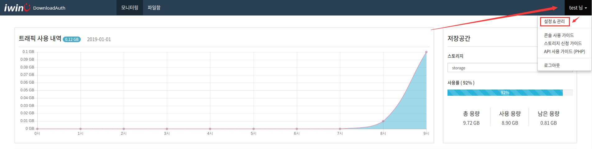
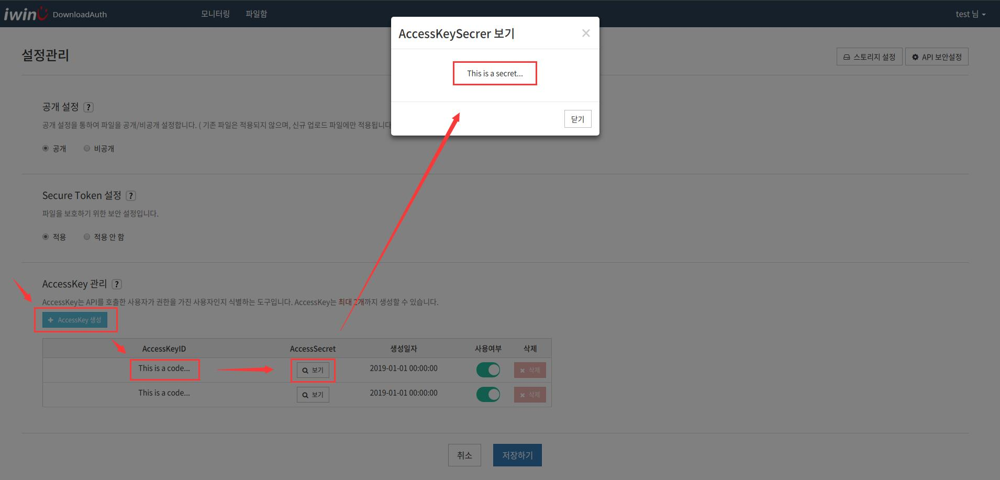
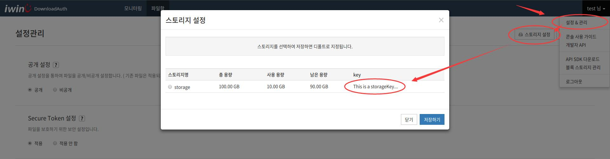
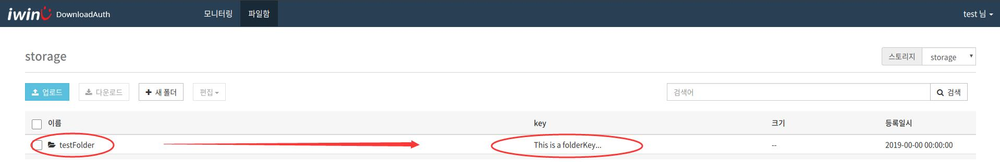

# Download Auth


SDK for iwinv download auth API.<br>
SDK 를 사용하면 편리하고 안전하게 API 연결을 할수있다.


## Setting


`setting.php` 파일은 기본설정파일이다.

* API서버 도메인을 `setting.php`의`apiDomain`로 설정한다.
* API 버전을 `setting.php`의`version`로 설정한다.


* 아래 그림과 같이 콘솔사이트에서 `사용자명` 메뉴 -> `설정&관리` -> `AccessKey 관리` 에서 accesskey를 생성하고 **accesskey ID** 과 **secret**를 `setting.php`의`accesskeyId`,`accesskeySecret` 로 설정한다.

<p align="center">
  
</p>

<p align="center">
  
</p>


* 아래 그림과 같이 콘솔사이트에서 `사용자명` 메뉴 -> `설정&관리` -> `스토리지 설정`창에서 **storageKey**를 `setting.php`의`storageKey`로 설정한다.

<p align="center">
  
</p>


* 아래 그림과 같이 콘솔사이트 파일함에서 해당폴더의 **folderKey**를 `setting.php`의`folderKey`로 설정한다.

<p align="center">
  
</p>


## Authentication.class.php


클레스에서 아래와 같이 메소드를 포함하여 호출해서 사용할수 있다.

* `getToken ()` -> 인증 Token 신청. ( `setting.php` 설정필요 ) 
* `storageTotal ( $token = '' , $storageKey = '' )` -> 스토리지 총용량 검색.
* `storageRest ( $token = '' , $storageKey = '' )` -> 스토리지 남은용량 검색.
* `storageUsed ( $token = '' , $storageKey = '' )` -> 스토리지 사용용량 검색.
* `storagesSelect ( $token = '' , $storageKey = '' )` -> 스토리지 검색 (상세&리스트).
* `contentsListSelect ( $token = '' , $folderKey = '' )` -> 컨텐츠 리스트 검색.
* `contentsSelect ( $token = '' , $contentsKey )` -> 컨텐츠 상세 검색.
* `folderCreate ( $token = '' , $folderKey = '' , $folderName )` -> 목록생성.
* `foldersSelect ( $token = '' , $action = '' , $folderKey = '' )` -> 목록 조회.
* `contentsDelete ( $token = '' , $contentsKeys )` -> 컨텐츠 삭제 ( 멀티 ).
* `contentsNameUpdate ( $token = '' , $contentsKey , $contentsName )` -> 컨텐츠명 수정.
* `tagUpdate ( $token = '' , $contentsKey , $tag = '' )` -> 태그 수정.
* `downloadLink ( $token = '' , $contentsKey )` -> 다운로드 주소 요청.

인증Token 는 `getToken ()` 로 생성하면 깉은 오브젝트에서 저장하고있어서 아래와같이 $storages1;$storages2;$storages3 내용이 같다.
```
$AUTH = new Authentication ( $_API );
$token = $AUTH -> getToken ();
$storages1 = $AUTH -> storagesSelect ( $AUTH -> token );
$storages2 = $AUTH -> storagesSelect ( $token );
$storages3 = $AUTH -> storagesSelect ();
```

## 버전관리


최신버전은 `v1` 이다.
`setting.php`의 `version`로 설정한다.
